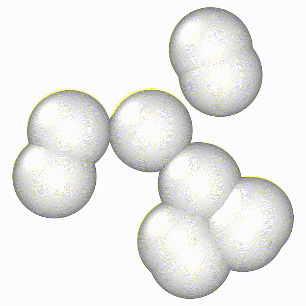

# md-lv
Simulation code of overdamped Langevin dynamics with periodic boundary conditions in Rust. This code implements a basic simulation mode, as well as a gradient-descent based equilibration/quenching and the Chen and Horing method for biasing of the system potential. Due to the lack of internal neighbor data this code is meant to be run on quite small systems (N < 100). The binary `md-lv` is the main executable from which simulations are run. The `scripts` directory contains workflows for automating simulation execution, and `notebooks` contains code for the post-processing analysis.

<!--  -->

# Building
Building md-lv just requires `cargo` (the Rust build system), which is easily obtained by downloading `rustup` [here](https://www.rust-lang.org/tools/install). To build the binary into the `target` directory, execute

```bash
cargo build --release
```

Additionally, the binary can be installed to the `$PATH` by running

```bash
cargo install --path .
```

# Usage Description

Simply execute `./target/release/md-lv` (or just `md-lv` if you installed it to the `$PATH`) to run a basic simulation. CLI parameters can be shown with the `--help` flag.

# Production/Analysis Environment

Python scripts and Jupyter notebooks are used throughout to orchestrate the production of datasets, apply post-processing analysis, and generate plots for publication. Here we use `conda` to manage our Python environment, which is specified by `environment.yml`.

I commonly use `direnv` to manage my local environments for projects. It's a handy tool that automatically sets up development environments when you `cd` into a project folder, and instructions on its installation can be found [here](https://direnv.net/). Though its use isn't strictly necessary here, I find it helps immensely with the cognitive load of managing a consistent development/analysis environment.

If you have `direnv` and `conda` installed, the Python environment should be automatically configured the first time you `cd` into this project's root. If you don't have `direnv`, simply use the `environment.yml` file to create a new environment.

```bash
conda env create -f environment.yml
```

